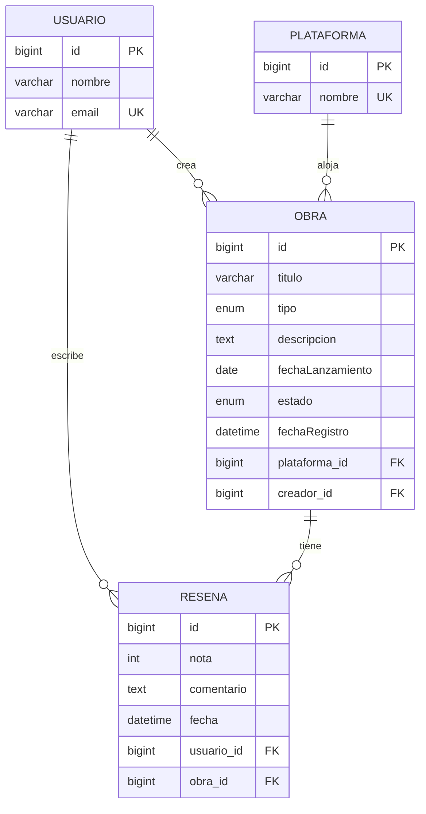

# MediaTracker

# Realizado por: Alberto Nieto Lozano y Alejandro Prieto Mellado

API REST para registrar obras (videojuegos, películas, libros, series), sus reseñas y su trazabilidad de cambios.

El proyecto combina:

- **SQL (MySQL + JPA/Hibernate)** para el dato transaccional principal.
- **MongoDB** para auditoría/eventos e historial de cambios.

---

## 1) ¿Qué hace el proyecto?

**MediaTracker** permite:

- Gestionar usuarios y plataformas.
- Crear, editar, listar y eliminar obras.
- Crear, editar, listar y eliminar reseñas sobre obras.
- Registrar en Mongo los eventos de auditoría (CREATE/UPDATE/DELETE) y los cambios de estado/datos de obras.

---

## 2) Estructura del proyecto

```text
src/main/java/com/tuapp
├── config/
├── controller/             # Endpoints REST
├── domain/                 # Entidades JPA (modelo relacional)
├── dto/                    # DTOs de entrada/salida para API y agregaciones
├── mongo/                  # Documentos y repositorios Mongo
├── repository/             # Repositorios JPA (consultas SQL)
└── service/                # Lógica de negocio e integración SQL↔Mongo
```

### Capas principales

- **Controller**: recibe HTTP, valida request y devuelve response.
- **Service**: aplica reglas, guarda en SQL y registra evidencia en Mongo.
- **Repository (JPA/MongoRepository)**: acceso a datos.
- **DTO**: contrato de API (evita exponer entidades directamente en todos los casos).

---

## 3) Script/guía de despliegue local (MySQL + Mongo + API)

## Requisitos

- Java 17
- Maven 3.9+
- MongoDB
- MySQL

## 3.1 Preparar MySQL y Mongo (instalación local, sin Docker)

1. Tener **MySQL Server** instalado y en ejecución en `localhost:3306`.
2. Tener **MongoDB Community Server** instalado y en ejecución en `localhost:27017`.
3. Crear la base de datos SQL `mediatracker`.

Crear el usuario SQL que usa la app (`mediatracker_user` / `mediatracker_pass`):

```sql
CREATE DATABASE IF NOT EXISTS mediatracker;
CREATE USER IF NOT EXISTS 'mediatracker_user'@'%' IDENTIFIED BY 'mediatracker_pass';
GRANT ALL PRIVILEGES ON mediatracker.* TO 'mediatracker_user'@'%';
FLUSH PRIVILEGES;
```

## 3.2 Verificar configuración

La app usa por defecto:

- MySQL: `jdbc:mysql://localhost:3306/mediatracker`
- Mongo: `mongodb://localhost:27017/mediatracker`

(Configurado en `src/main/resources/application.properties`).

## 3.3 Ejecutar la API

```powershell
mvn clean spring-boot:run
```

URLs útiles:

- API: `http://localhost:8080`
- Swagger UI: `http://localhost:8080/swagger-ui.html`

---

## 4) Endpoints principales

## SQL (CRUD)

- `POST /usuarios`, `GET /usuarios`, `PUT /usuarios/{id}`, `DELETE /usuarios/{id}`
- `POST /plataformas`, `GET /plataformas`, `PUT /plataformas/{id}`, `DELETE /plataformas/{id}`
- `POST /obras`, `GET /obras`, `GET /obras/{id}`, `PUT /obras/{id}`, `DELETE /obras/{id}`
- `POST /resenas`, `GET /resenas/obra/{obraId}`, `PUT /resenas/{id}`, `DELETE /resenas/{id}`

## Mongo (consulta de trazabilidad)

- `GET /eventos/usuario/{userId}`
- `GET /eventos/entidad/{entityId}`
- `GET /eventos/rango?inicio=...&fin=...`
- `GET /historial-obras/obra/{obraId}`
- `GET /historial-obras/usuario/{userId}`
- `GET /historial-obras/rango?inicio=...&fin=...`
- `GET /historial-obras/metricas/cambios-por-accion`

---

## 5) Tema y reglas del negocio

## Tema

MediaTracker centraliza el seguimiento de obras de distintos tipos (`VIDEOJUEGO`, `PELICULA`, `LIBRO`, `SERIE`) y su valoración mediante reseñas.

El sistema separa claramente:

- el dato transaccional y relacional (SQL),
- y el dato de trazabilidad/auditoría (MongoDB).

## Reglas de negocio implementadas

- Una obra requiere `titulo`, `tipo`, `estado`, `usuarioId` y `plataformaNombre`; si falta alguno, se rechaza la operación.
- El `estado` de una obra se normaliza con enum (`PENDIENTE`, `EN_PROGRESO`, `COMPLETADO`, `ABANDONADO`).
- El tipo de obra se normaliza con enum (`VIDEOJUEGO`, `PELICULA`, `LIBRO`, `SERIE`).
- La reseña requiere `usuarioId`, `obraId` y `nota`; la `nota` está validada entre `0` y `10`.
- La creación/actualización de obra exige que exista el usuario creador.
- Si la plataforma indicada no existe, se crea automáticamente y se vincula a la obra.
- En operaciones de obra y reseña se registra un evento en Mongo (`CREATE_*`, `UPDATE_*`, `DELETE_*`).
- Al actualizar obra se almacena además un historial con snapshot `antes` y `despues`.

---

## 6) Modelo SQL (entidades y relaciones)

## Entidades JPA

- `Usuario` (`usuarios`): `id`, `nombre`, `email` (único).
- `Plataforma` (`plataformas`): `id`, `nombre` (único).
- `Obra` (`obras`):
  - Campos principales: `id`, `titulo`, `tipo`, `descripcion`, `fechaLanzamiento`, `estado`, `fechaRegistro`.
  - Claves foráneas: `plataforma_id`, `creador_id`.
- `Resena` (`resenas`): `id`, `nota`, `comentario`, `fecha`, `usuario_id`, `obra_id`.

Persistencia y consistencia:

- El modelo se gestiona con JPA/Hibernate.
- `spring.jpa.hibernate.ddl-auto=update` permite evolucionar el esquema automáticamente en desarrollo.
- Se mantienen restricciones de unicidad en `usuarios.email` y `plataformas.nombre`.

## Relaciones

- `Obra` **N:1** `Usuario` (creador)
- `Obra` **N:1** `Plataforma`
- `Resena` **N:1** `Usuario`
- `Resena` **N:1** `Obra`

## Diagrama entidad-relación



Consultas SQL relevantes implementadas:

- Filtrado combinado de obras por `tipo`, `estado` y `creador` con paginación.
- Consulta de obras con reseñas mediante `JOIN` (`findObrasConResenas`).
- Cálculo de media de nota por tipo de obra (`mediaNotaPorTipo`).

---

## 7) ¿Qué se guarda en Mongo y por qué?

## Colecciones

1. **`eventos`**
   - Registra auditoría operativa de acciones sobre entidades.
   - Campos: `timestamp`, `userId`, `entityType`, `entityId`, `type`, `payload`.
   - Ejemplos de `type`: `CREATE_OBRA`, `UPDATE_OBRA`, `DELETE_OBRA`, `CREATE_RESENA`, `UPDATE_RESENA`, `DELETE_RESENA`.
   - `payload` guarda datos de contexto (por ejemplo: título, estado, tipo, IDs asociados).

   **Ejemplo de documento en `eventos`:**

   ```json
   {
     "_id": "65f8a3b2c4e1d2f3a4b5c6d7",
     "timestamp": "2026-02-22T14:35:42.123Z",
     "userId": 1,
     "entityType": "Obra",
     "entityId": 5,
     "type": "CREATE_OBRA",
     "payload": {
       "titulo": "Elden Ring",
       "estado": "EN_PROGRESO",
       "tipo": "VIDEOJUEGO"
     }
   }
   ```

2. **`historial_obras`**
   - Guarda trazabilidad detallada de cambios en obras.
   - Campos: `obraId`, `userId`, `timestamp`, `accion`, `antes`, `despues`.
   - Se utiliza en actualizaciones para conservar snapshot anterior y posterior.

   **Ejemplo de documento en `historial_obras`:**

   ```json
   {
     "_id": "65f8b1c2d3e4f5a6b7c8d9e0",
     "obraId": 5,
     "userId": 1,
     "timestamp": "2026-02-22T15:20:18.456Z",
     "accion": "UPDATE_OBRA",
     "antes": {
       "id": 5,
       "titulo": "Elden Ring",
       "tipo": "VIDEOJUEGO",
       "estado": "EN_PROGRESO",
       "descripcion": "RPG",
       "plataformaNombre": "Steam"
     },
     "despues": {
       "id": 5,
       "titulo": "Elden Ring",
       "tipo": "VIDEOJUEGO",
       "estado": "COMPLETADO",
       "descripcion": "RPG - actualizado",
       "plataformaNombre": "Steam"
     }
   }
   ```

Consultas Mongo implementadas:

- Búsqueda de eventos por `userId`, por `entityId` y por rango de fechas.
- Búsqueda de historial por `obraId`, por `userId` y por rango de fechas.
- Agregación `cambios-por-accion` para contar modificaciones por tipo de acción.

## Justificación

- SQL almacena el estado vigente de negocio y las relaciones entre entidades.
- Mongo almacena trazabilidad en formato JSON flexible, útil para auditoría e historial.
- Esta separación evita sobrecargar tablas relacionales con información de seguimiento temporal.
- El diseño mejora la observabilidad del sistema sin duplicar la lógica principal de dominio.

---

## 8) Cierre: mejoras pendientes y aprendizajes

## Mejoras pendientes

- Añadir autenticación/autorización (Spring Security + JWT).
- Añadir tests de integración y cobertura de casos límite.
- Exponer endpoint para media de nota por tipo (`mediaNotaPorTipo`) ya implementada en repositorio/servicio.
- Fortalecer manejo transaccional explícito (`@Transactional`) en flujos compuestos.

## Aprendizajes

- Cuándo modelar relacional vs documental.
- Cómo integrar SQL y Mongo sin duplicar toda la lógica.
- Cómo diseñar auditoría trazable para cambios críticos.

---
