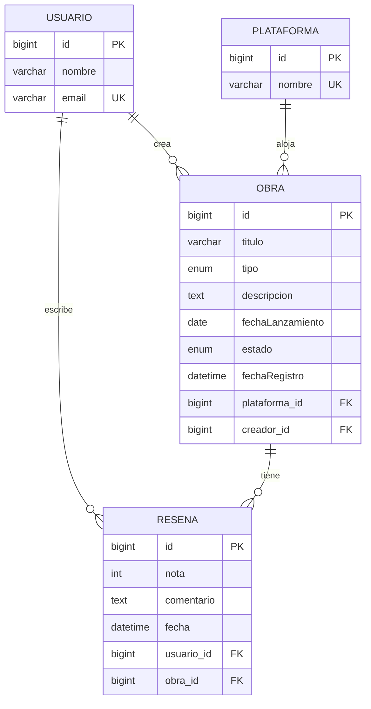

Aplica todo exceptuando los emojis:
# MediaTracker

     

Realizado por: Alberto Nieto Lozano y Alejandro Prieto Mellado

API REST para registrar obras (videojuegos, películas, libros, series), sus reseñas y su trazabilidad de cambios. Combina SQL (MySQL + JPA/Hibernate) para el dato transaccional y MongoDB para auditoría e historial.

---

## 1) Qué hace el proyecto

**MediaTracker** permite:

* Gestionar usuarios y plataformas.
* Crear, editar, listar y eliminar obras.
* Crear, editar, listar y eliminar reseñas sobre obras.
* Registrar en Mongo los eventos de auditoría y los snapshots de cambios en obras.

---

## 2) Modelo SQL - entidades y relaciones

### Entidades JPA

* `Usuario` (`usuarios`): `id`, `nombre`, `email` único.
* `Plataforma` (`plataformas`): `id`, `nombre` único.
* `Obra` (`obras`):

  * `id`, `titulo`, `tipo`, `descripcion`, `fechaLanzamiento`, `estado`, `fechaRegistro`.
  * FK: `plataforma_id`, `creador_id`.
* `Resena` (`resenas`): `id`, `nota`, `comentario`, `fecha`, `usuario_id`, `obra_id`.

### Persistencia y restricciones

* Gestionado con JPA/Hibernate.
* `spring.jpa.hibernate.ddl-auto=update` para evolución de esquema en desarrollo.
* Unicidad en `usuarios.email` y `plataformas.nombre`.

### Relaciones

* `Obra` N:1 `Usuario` (creador)
* `Obra` N:1 `Plataforma`
* `Resena` N:1 `Usuario`
* `Resena` N:1 `Obra`

### Diagrama entidad-relación



### Consultas SQL relevantes

* Filtrado combinado de obras por `tipo`, `estado` y `creador` con paginación.
* Consulta de obras con reseñas mediante `JOIN` (`findObrasConResenas`).
* Cálculo de media de nota por tipo de obra (`mediaNotaPorTipo`).

---

## 3) Tema y reglas de negocio

### Tema

Seguimiento centralizado de obras de tipos `VIDEOJUEGO`, `PELICULA`, `LIBRO`, `SERIE` y su valoración mediante reseñas. Separación clara entre dato transaccional relacional y dato de trazabilidad documental.

### Reglas de negocio

* Una obra requiere `titulo`, `tipo`, `estado`, `usuarioId` y `plataformaNombre`. Si falta alguno se rechaza la operación.
* `estado` normalizado con enum `PENDIENTE`, `EN_PROGRESO`, `COMPLETADO`, `ABANDONADO`.
* `tipo` normalizado con enum `VIDEOJUEGO`, `PELICULA`, `LIBRO`, `SERIE`.
* Reseña requiere `usuarioId`, `obraId` y `nota`. `nota` validada entre 0 y 10.
* Creación/actualización de obra exige existencia del usuario creador.
* Si la plataforma indicada no existe, se crea automáticamente y se vincula a la obra.
* Operaciones de obra y reseña generan eventos en Mongo con tipos `CREATE_*`, `UPDATE_*`, `DELETE_*`.
* Al actualizar una obra se almacena un historial con snapshot `antes` y `despues`.

---

## 4) Qué se guarda en Mongo y por qué

### Colecciones y propósito

1. `eventos`

   * Auditoría operativa de acciones sobre entidades.
   * Campos principales: `timestamp`, `userId`, `entityType`, `entityId`, `type`, `payload`.
   * Ejemplo de `type`: `CREATE_OBRA`, `UPDATE_OBRA`, `DELETE_OBRA`, `CREATE_RESENA`, `UPDATE_RESENA`, `DELETE_RESENA`.

2. `historial_obras`

   * Trazabilidad detallada de cambios en obras.
   * Campos: `obraId`, `userId`, `timestamp`, `accion`, `antes`, `despues`.
   * Se usa para conservar snapshot anterior y posterior en actualizaciones.

### Ejemplos de documento

`eventos`:

```json
{
  "_id": "65f8a3b2c4e1d2f3a4b5c6d7",
  "timestamp": "2026-02-22T14:35:42.123Z",
  "userId": 1,
  "entityType": "Obra",
  "entityId": 5,
  "type": "CREATE_OBRA",
  "payload": {
    "titulo": "Elden Ring",
    "estado": "EN_PROGRESO",
    "tipo": "VIDEOJUEGO"
  }
}
```

`historial_obras`:

```json
{
  "_id": "65f8b1c2d3e4f5a6b7c8d9e0",
  "obraId": 5,
  "userId": 1,
  "timestamp": "2026-02-22T15:20:18.456Z",
  "accion": "UPDATE_OBRA",
  "antes": {
    "id": 5,
    "titulo": "Elden Ring",
    "tipo": "VIDEOJUEGO",
    "estado": "EN_PROGRESO",
    "descripcion": "RPG",
    "plataformaNombre": "Steam"
  },
  "despues": {
    "id": 5,
    "titulo": "Elden Ring",
    "tipo": "VIDEOJUEGO",
    "estado": "COMPLETADO",
    "descripcion": "RPG - actualizado",
    "plataformaNombre": "Steam"
  }
}
```

### Consultas Mongo implementadas

* Buscar eventos por `userId`, por `entityId` y por rango de fechas.
* Buscar historial por `obraId`, por `userId` y por rango de fechas.
* Agregación `cambios-por-accion` para contar modificaciones por tipo de acción.

### Justificación

* SQL almacena el estado vigente con relaciones.
* Mongo guarda trazabilidad en JSON flexible para auditoría e historial.
* Separación evita sobrecargar tablas relacionales con información temporal y mejora observabilidad.

---

## 5) Estructura del proyecto

```
src/main/java/com/tuapp
├── config/
├── controller/             # Endpoints REST
├── domain/                 # Entidades JPA
├── dto/                    # DTOs de entrada y salida
├── mongo/                  # Documentos y repositorios Mongo
├── repository/             # Repositorios JPA
└── service/                # Lógica de negocio e integración SQL-Mongo
```

### Capas principales

* **Controller**: recibe HTTP, valida request y devuelve response.
* **Service**: aplica reglas, persiste en SQL y registra evidencia en Mongo.
* **Repository**: acceso a datos con JPA y MongoRepository.
* **DTO**: contrato de API que evita exponer entidades directamente.

---

## 6) Endpoints principales

### SQL (CRUD)

* `POST /usuarios`

* `GET /usuarios`

* `PUT /usuarios/{id}`

* `DELETE /usuarios/{id}`

* `POST /plataformas`

* `GET /plataformas`

* `PUT /plataformas/{id}`

* `DELETE /plataformas/{id}`

* `POST /obras`

* `GET /obras`

* `GET /obras/{id}`

* `PUT /obras/{id}`

* `DELETE /obras/{id}`

* `POST /resenas`

* `GET /resenas/obra/{obraId}`

* `PUT /resenas/{id}`

* `DELETE /resenas/{id}`

### Mongo (consulta de trazabilidad)

* `GET /eventos/usuario/{userId}`
* `GET /eventos/entidad/{entityId}`
* `GET /eventos/rango?inicio=...&fin=...`
* `GET /historial-obras/obra/{obraId}`
* `GET /historial-obras/usuario/{userId}`
* `GET /historial-obras/rango?inicio=...&fin=...`
* `GET /historial-obras/metricas/cambios-por-accion`

---

## 7) Script y guía de despliegue local

### Requisitos

* Java 17
* Maven 3.9 o superior
* MongoDB Community Server
* MySQL Server

### Preparar MySQL y Mongo (instalación local)

1. Tener MySQL en `localhost:3306`.
2. Tener MongoDB en `localhost:27017`.
3. Crear base de datos SQL `mediatracker` y usuario:

```sql
CREATE DATABASE IF NOT EXISTS mediatracker;
CREATE USER IF NOT EXISTS 'mediatracker_user'@'%' IDENTIFIED BY 'mediatracker_pass';
GRANT ALL PRIVILEGES ON mediatracker.* TO 'mediatracker_user'@'%';
FLUSH PRIVILEGES;
```

### Verificar configuración

Valores por defecto en `src/main/resources/application.properties`:

* MySQL: `jdbc:mysql://localhost:3306/mediatracker`
* Mongo: `mongodb://localhost:27017/mediatracker`

### Ejecutar la API

```powershell
mvn clean spring-boot:run
```

URLs útiles:

* API: `http://localhost:8080`
* Swagger UI: `http://localhost:8080/swagger-ui.html`

---

## 8) Mejoras pendientes y aprendizajes

### Mejoras pendientes

* Añadir autenticación y autorización con Spring Security y JWT.
* Añadir tests de integración y cubrir casos límite.
* Exponer endpoint para media de nota por tipo `mediaNotaPorTipo`.
* Fortalecer el manejo transaccional explícito con `@Transactional` en flujos compuestos.

### Aprendizajes

* Cuándo modelar relacional frente a documental.
* Cómo integrar SQL y Mongo sin duplicar lógica.
* Cómo diseñar auditoría trazable para cambios críticos.
